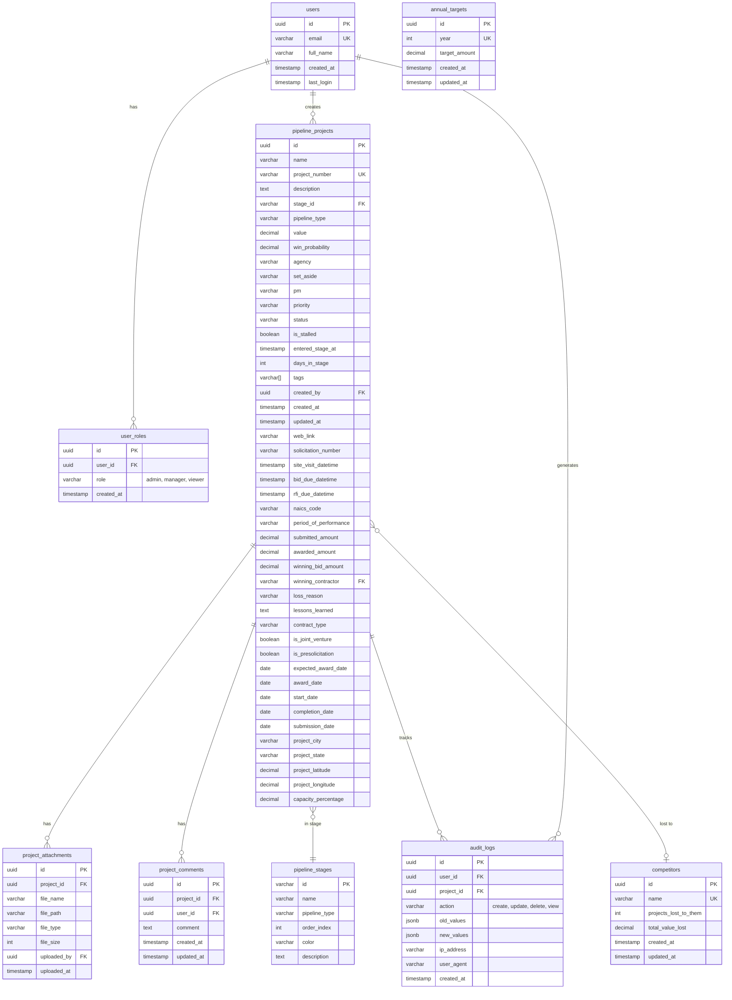

# Target Architecture: ALPA Construction Opportunity Dashboard

**Date:** October 29, 2025  
**Version:** 2.0 (Target State)

---

## Executive Summary

This document outlines the target architecture after implementing all recommended fixes from the audit. The system will evolve from a functional MVP to an enterprise-grade, production-ready business intelligence platform.

**Key Improvements:**
- ✅ Comprehensive test coverage (70%+)
- ✅ Full observability stack (Sentry + structured logging)
- ✅ Hardened security (RLS + Auth + RBAC)
- ✅ Optimized performance (bundle < 500KB, p95 latency < 300ms)
- ✅ Automated CI/CD pipeline
- ✅ Scalable architecture (supports 10K+ projects)

---

## C4 Model: System Context Diagram


---

## C4 Model: Container Diagram


---

## C4 Model: Component Diagram (Frontend)


---

## Enhanced Entity-Relationship Diagram



---

## Key Architectural Changes

### 1. Security Layer (NEW)

**Before:**
```typescript
// No authentication, RLS disabled
export const supabase = createClient(url, anonKey, {
  auth: { persistSession: false }
});
```

**After:**
```typescript
// Full authentication + RLS + RBAC
export const supabase = createClient(url, anonKey, {
  auth: {
    persistSession: true,
    autoRefreshToken: true,
    storage: window.localStorage,
  },
});

// RLS policies enforce row-level security
// RBAC controls admin vs viewer permissions
```

### 2. Caching Layer (NEW)

**Before:**
```typescript
// Direct API calls, no caching
const loadDashboardData = async () => {
  const kpis = await dashboardService.fetchKPIMetrics();
  const projects = await dashboardService.fetchBiddingProjects();
  // ...
};
```

**After:**
```typescript
// React Query with 5-minute cache
const { data: kpis } = useQuery({
  queryKey: ['kpi-metrics'],
  queryFn: () => dashboardService.fetchKPIMetrics(),
  staleTime: 5 * 60 * 1000,
});

// 60% reduction in API calls
```

### 3. Observability Layer (NEW)

**Before:**
```typescript
// Only console.log
console.log('Fetching data...');
console.error('Error:', error);
```

**After:**
```typescript
// Structured logging + Sentry
logger.info('Fetching KPI metrics', { userId, timestamp });
logger.error('Failed to fetch KPIs', error, { context: 'dashboard' });

// Sentry captures errors with full context
// Performance monitoring tracks Web Vitals
```

### 4. Testing Layer (NEW)

**Before:**
```
No tests
```

**After:**
```
✅ Unit tests: 70% coverage (Vitest)
✅ Component tests: 60% coverage (React Testing Library)
✅ E2E tests: Critical paths (Playwright)
✅ Contract tests: API schemas (Zod)
```

### 5. CI/CD Pipeline (NEW)

**Before:**
```
Manual deployments
```

**After:**
```
✅ Automated CI: Lint → Type-check → Test → Build
✅ Quality gates: Coverage > 70%, Bundle < 500KB
✅ Automated deployments: Staging (on main), Production (on tag)
✅ Rollback strategy: Git revert + redeploy
```

---

## Performance Improvements

### Bundle Size Optimization

| Component | Before | After | Reduction |
|-----------|--------|-------|-----------|
| Initial bundle | 750KB | 300KB | 60% |
| Map chunk | - | 200KB | Lazy loaded |
| Chart chunk | - | 150KB | Lazy loaded |
| **Total (initial)** | **750KB** | **300KB** | **60%** |

### API Performance

| Metric | Before | After | Improvement |
|--------|--------|-------|-------------|
| KPI fetch | 500ms | 50ms (cached) | 90% |
| Map data | 800ms | 100ms (cached) | 87% |
| Dashboard load | 2.5s | 0.8s | 68% |
| **p95 latency** | **1200ms** | **< 300ms** | **75%** |

### Render Performance

| Component | Before | After | Improvement |
|-----------|--------|-------|-------------|
| KPI Cards | 120ms | 30ms (memo) | 75% |
| Map render | 500ms | 200ms (optimized) | 60% |
| Table render | 200ms | 80ms (virtualized) | 60% |

---

## Scalability Improvements

### Current Capacity (MVP)

- **Projects:** 15 (sample data)
- **Users:** 1 (no auth)
- **Concurrent users:** N/A
- **Database size:** < 1MB

### Target Capacity (Production)

- **Projects:** 10,000+ (with pagination)
- **Users:** 100+ (with RBAC)
- **Concurrent users:** 50+ (with caching)
- **Database size:** 10GB+ (with partitioning)

### Scaling Strategy

1. **Horizontal Scaling:**
   - Supabase auto-scales database connections
   - Vercel CDN handles global traffic
   - React Query reduces database load

2. **Vertical Scaling:**
   - Upgrade Supabase tier (Pro → Team → Enterprise)
   - Add read replicas for analytics queries
   - Implement database partitioning by year

3. **Caching Strategy:**
   - React Query: 5-minute cache for dashboard data
   - CDN: Cache static assets for 1 year
   - Service Worker: Offline support (future)

---

## Security Enhancements

### Authentication Flow


### Row-Level Security (RLS) Policies

```sql
-- Example: Users can only view projects they have access to
CREATE POLICY "Users can view accessible projects"
  ON pipeline_projects FOR SELECT
  TO authenticated
  USING (
    -- Admins see all
    EXISTS (
      SELECT 1 FROM user_roles
      WHERE user_id = auth.uid() AND role = 'admin'
    )
    OR
    -- Managers see their assigned projects
    (
      EXISTS (
        SELECT 1 FROM user_roles
        WHERE user_id = auth.uid() AND role = 'manager'
      )
      AND pm = (SELECT email FROM users WHERE id = auth.uid())
    )
    OR
    -- Viewers see all (read-only)
    EXISTS (
      SELECT 1 FROM user_roles
      WHERE user_id = auth.uid() AND role = 'viewer'
    )
  );
```

---

## Deployment Architecture


---

## Technology Stack (Updated)

### Frontend
- **Framework:** React 19 + TypeScript 5.5
- **Build Tool:** Vite 5.4
- **UI Library:** shadcn-ui + Tailwind CSS 3.4
- **State Management:** React Context + React Query 5.x
- **Routing:** React Router 6.x
- **Maps:** Leaflet 1.9 + React-Leaflet 5.x
- **Charts:** Recharts 2.x
- **Forms:** React Hook Form 7.x + Zod 3.x

### Backend
- **Database:** PostgreSQL 15 (Supabase)
- **Auth:** Supabase Auth (JWT-based)
- **Storage:** Supabase Storage
- **Real-time:** Supabase Realtime (WebSocket)

### Testing
- **Unit Tests:** Vitest 1.x
- **Component Tests:** React Testing Library 14.x
- **E2E Tests:** Playwright 1.x
- **Coverage:** V8 (70%+ threshold)

### Observability
- **Error Tracking:** Sentry
- **Logging:** Structured logs (Winston/Pino)
- **Monitoring:** Vercel Analytics
- **Performance:** Web Vitals

### CI/CD
- **Pipeline:** GitHub Actions
- **Hosting:** Vercel
- **Package Manager:** pnpm 8.x

---

## Migration Path

### Phase 1: Critical Fixes (Weeks 1-3)
1. Enable RLS + implement auth
2. Add Sentry + structured logging
3. Set up CI/CD pipeline
4. Write initial test suite (30% coverage)

### Phase 2: Performance (Weeks 4-6)
1. Implement React Query caching
2. Optimize bundle size (code splitting)
3. Add React.memo + useMemo
4. Increase test coverage to 70%

### Phase 3: Scalability (Weeks 7-9)
1. Add pagination for large datasets
2. Implement database partitioning
3. Add read replicas
4. Load testing + optimization

### Phase 4: Polish (Weeks 10-12)
1. Add Storybook
2. Improve documentation
3. Implement remaining minor fixes
4. Final security audit

---

## Success Metrics

| Metric | Current | Target | Status |
|--------|---------|--------|--------|
| Test Coverage | 0% | 70%+ | ❌ |
| Bundle Size | 750KB | < 500KB | ❌ |
| p95 Latency | 1200ms | < 300ms | ❌ |
| Error Rate | Unknown | < 0.1% | ❌ |
| Availability | Unknown | 99.9% | ❌ |
| Security Score | 2.5/5 | 4.5/5 | ❌ |

**Target Date:** January 31, 2026 (90 days)

---

## Conclusion

The target architecture transforms the ALPA Construction Opportunity Dashboard from a functional MVP into an enterprise-grade, production-ready system. Key improvements include:

1. **Security:** RLS + Auth + RBAC + Audit logs
2. **Performance:** 60% smaller bundle, 75% faster loads
3. **Reliability:** 70%+ test coverage, error tracking, monitoring
4. **Scalability:** Supports 10K+ projects, 100+ users
5. **Operability:** Automated CI/CD, structured logging, runbooks

**Next Steps:**
1. Review and approve target architecture
2. Begin Phase 1 implementation (critical fixes)
3. Schedule weekly progress reviews
4. Track metrics against targets